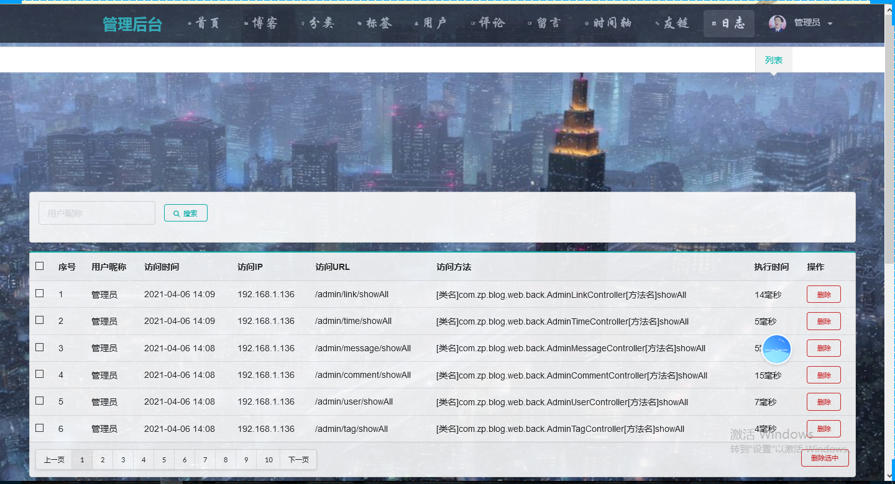
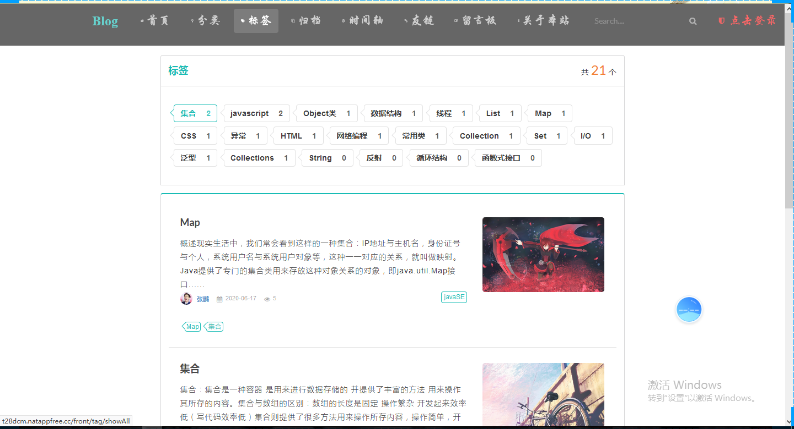
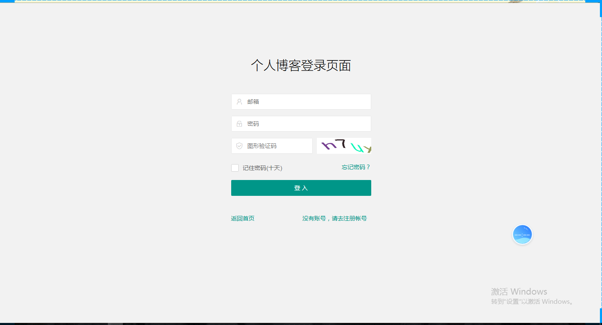

所用的技术：SpringBoot+SpringSecurity+Mybatis+Mysql+Redis+Thymeleaf+JQuery

系统介绍：本系统是一个基于springBoot前后端不分离个人博客的管理系统，用户可以注册账号并登陆系统查看发布的文章并进行阅读评论等

CSDN博客地址：https://blog.csdn.net/m0_47220500/article/details/125158453

B站运行视频： https://www.bilibili.com/video/BV1oY411T7fy

项目下载地址：http://shiyuncode.com/details?id=16

本系统主要有三种用户：
1、游客：没有登陆的用户，可以查询文章，但是无法进行评论，系统中的所有文章可以通过内容搜索，可以通过分类搜索也可以通过标签就行搜索

2、注册用户：可以对所有的文章进行阅读以及评论等功能，可以对文章进行赞赏（支付宝或者微信付钱）

3、自己：拥有注册用户的所有权限，管理分类以及发布文章和管理标签等，友链管理，时间轴管理等

需要配置邮箱发送，redis账号。
用户密码：mt2680324

管理员：

用户（游客）：

